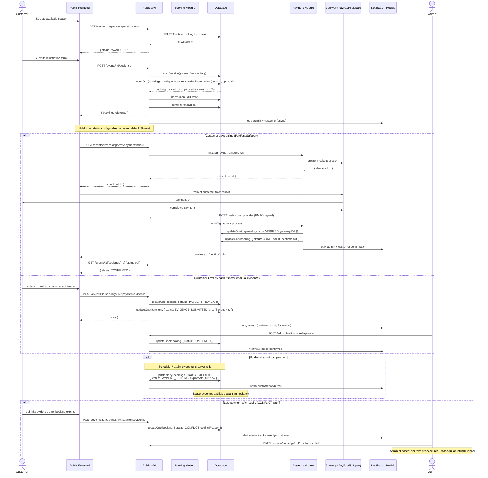
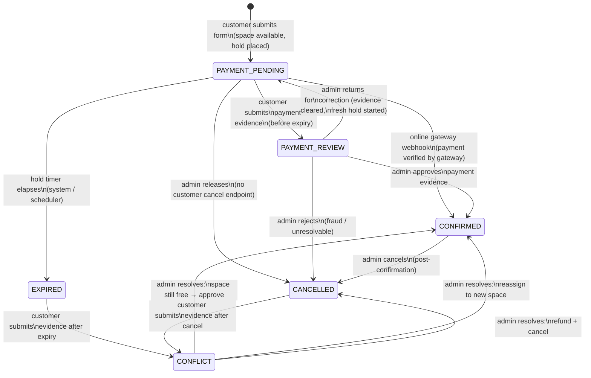
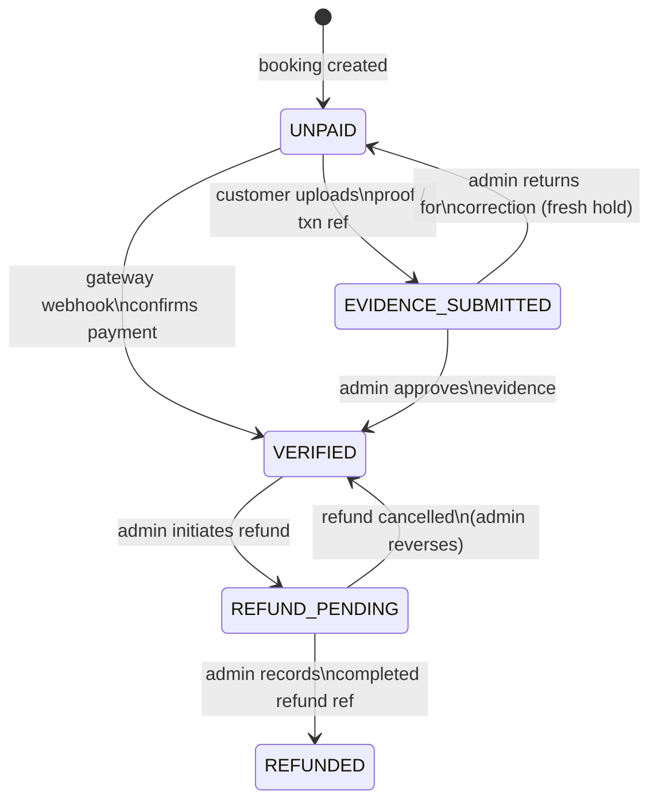

# ARCHITECTURE.md
## Vision71 Technologies — Generic Event/Exhibition Booking Engine
### Sprint Architecture Document · Author: Architecture Lead · Status: FROZEN BASELINE · v1.2

---

> **Scope of this document.** This is the authoritative technical specification that the
> backend will be built against. Frontend teammates (Zaid — public site, Ibrahim — admin
> portal) should treat the API contract in §8 as stable. No implementation code has been
> written yet; this document freezes decisions before backend work begins.
>
> **Primary source reviewed:** `zaidasim2197/floor-plan-visualizer` branch `generic-event`.
> All type shapes, state machines, and behavior contracts in this document are reconciled
> against the working prototype.

---

## Table of Contents

1. [System Architecture](#1-system-architecture)
2. [Booking and Payment State Model](#2-booking-and-payment-state-model)
3. [Concurrency Strategy](#3-concurrency-strategy)
4. [Payment Abstraction](#4-payment-abstraction)
5. [Security Model](#5-security-model)
6. [Floor-Plan Data Model](#6-floor-plan-data-model)
7. [API Contract](#7-api-contract)
8. [Assumptions](#8-assumptions)
9. [Critical-Failure List](#9-critical-failure-list)
10. [Delta from Current Prototype](#10-delta-from-current-prototype)

---

## 1. System Architecture

### 1.1 Core Entities and Relationships

Every entity is scoped by `eventId`. Adding a second, completely unrelated event is a
data operation (insert documents); it never requires a code change.

Collections and their references (each arrow is a Mongoose `ref` / ObjectId field):

```
events          ← root collection; no parent ref
spaces          → events        (space.eventId: ObjectId ref Event)
floorPlans      → events        (floorPlan.eventId: ObjectId ref Event, 1:1)
floorElements   → floorPlans    (floorElement.floorPlanId: ObjectId ref FloorPlan)
bookings        → events        (booking.eventId: ObjectId ref Event)
                → spaces        (booking.spaceId: ObjectId ref Space)
payments        → bookings      (payment.bookingId: ObjectId ref Booking, 1:1)
auditEvents     → bookings      (auditEvent.bookingId: ObjectId ref Booking, optional)
notifications   → bookings      (notification.bookingId: ObjectId ref Booking, optional)
adminUsers      ← standalone collection; no event ref
eventAdminRoles → adminUsers    (role.adminUserId: ObjectId ref AdminUser)
                → events        (role.eventId: ObjectId ref Event)
```

**Event** — a single bookable event (name, dates, venue, currency, booking-timer config,
payment-provider config references, logo/branding). No event-specific details live in
application code.

**Space** (called "Stall" in the prototype) — a bookable unit within an event's floor plan
(number, zone, category, dimensions label, price, spatial position). References its parent
event via `eventId`.

**FloorPlan / FloorElement** — layout data for the SVG canvas: spaces with `(x, y, w, h)`,
plus read-only facility and aisle overlays. `FloorPlan` references its event via `eventId`;
`FloorElement` documents reference their floor plan via `floorPlanId`. Queried read-only
at runtime.

**Booking** — a customer's reservation of one space for one event. Carries both
`bookingStatus` and `paymentStatus` as independent fields (see §2). References event via
`eventId` and space via `spaceId`.

**Payment** — one document per booking, tracking provider, gateway reference, proof upload
reference, amounts, and webhook events received. Separated from Booking to allow
future multi-payment or refund documents without schema changes. References its booking
via `bookingId`.

**Customer** — name, email, phone, company, product/service. Not a user account; no
password. Identified by email within a booking. Customer fields are embedded on the
Booking document. PII considerations in §5.

**AuditEvent** — append-only log of every state transition, actor, and timestamp.
References booking via `bookingId` (optional — some audit events are system-level with
no associated booking).

**NotificationRecord** — log of every outbound email/message (audience, subject, body,
delivery status). Test mode vs. real delivery is a runtime flag, not a code change.
References booking via `bookingId` (optional).

**AdminUser** — a real authenticated user with role assignments per event stored in the
`eventAdminRoles` collection (see §5.1).

### 1.2 Component / Boundary Diagram

```mermaid
graph TD
    subgraph "Public Frontend (Zaid)"
        PF[TanStack Start SPA<br/>index / floor-plan / book / confirm / attendees]
    end

    subgraph "Admin Frontend (Ibrahim)"
        AF[Admin SPA<br/>event setup / space mgmt / booking mgmt / reporting]
    end

    subgraph "API Layer"
        PUB[Public API<br/>REST/JSON · unauthenticated or<br/>booking-token auth]
        ADM[Admin API<br/>REST/JSON · JWT session auth]
    end

    subgraph "Core Modules"
        BM[Booking Module<br/>hold · expiry · state machine]
        PM[Payment Module<br/>provider interface · webhook handler]
        NM[Notification Module<br/>email / WhatsApp dispatch]
        EM[Event/Space Module<br/>CRUD · floor plan · metrics]
    end

    subgraph "Infrastructure"
        DB[(MongoDB<br/>events · spaces · bookings<br/>payments · audit · notifications)]
        OBJ[(Object Storage<br/>payment proof images)]
        Q[Job Queue / Scheduler<br/>expiry sweep · notification dispatch)]
        CACHE[Cache Layer<br/>floor plan · availability<br/>read-only hot paths]
    end

    subgraph "External"
        GW1[PayFast Gateway]
        GW2[Safepay Gateway]
        GW3[Future: JazzCash · Easypaisa]
        SMTP[Email Provider]
    end

    PF -- HTTPS --> PUB
    AF -- HTTPS --> ADM
    PUB --> BM
    PUB --> PM
    ADM --> BM
    ADM --> PM
    ADM --> EM
    BM --> DB
    BM --> Q
    PM --> DB
    PM --> OBJ
    PM --> GW1
    PM --> GW2
    PM --> GW3
    NM --> SMTP
    BM --> NM
    PM --> NM
    EM --> DB
    EM --> CACHE
    GW1 -- webhook --> PM
    GW2 -- webhook --> PM
    GW3 -- webhook --> PM
```

### 1.3 Booking Flow Sequence Diagram



---

## 2. Booking and Payment State Model

### 2.1 Design Decision: Two Independent State Machines

Zaid's prototype already separates `BookingStatus` and `PaymentStatus` into two distinct
enums on the `Booking` record. This split is correct and is carried forward unchanged.
The justification: booking lifecycle (hold, confirmation, cancellation) and payment
lifecycle (evidence submission, gateway verification, refund) evolve at different rates
and are triggered by different actors. Conflating them into a single enum would require
adding a new combined value every time either dimension adds a state.

**What carries over from the prototype without change:**
- `BookingStatus` values: `PAYMENT_PENDING`, `PAYMENT_REVIEW`, `CONFIRMED`, `EXPIRED`,
  `CANCELLED`, `CONFLICT` — all retained.
- `PaymentStatus` values: `UNPAID`, `EVIDENCE_SUBMITTED`, `VERIFIED`, `REFUND_PENDING`,
  `REFUNDED` — Ibrahim's implementation adds `REFUNDED` as a terminal state distinct from
  `REFUND_PENDING`. `REFUND_PENDING` means the admin has decided a refund is owed but has
  not yet recorded the transaction. `REFUNDED` means the admin has recorded a completed
  refund reference — money has been returned (or confirmed returned). These are two
  distinct states and must not be collapsed.
- The `ACTIVE_STATUSES` constant (`PAYMENT_PENDING | PAYMENT_REVIEW | CONFIRMED`) used to
  determine whether a space is occupied — retained.

**What changes:**
- `CONFLICT` gains a defined resolution path (see §2.4) instead of being a terminal state.
- The `statusLabel` map (currently in the frontend, maps `EXPIRED` and `CANCELLED` to
  "Available") moves to the API — the API response for space status returns a derived
  `displayStatus` field computed server-side.
- `paymentStatus = "VERIFIED"` on a `CONFIRMED` booking is the canonical signal that money
  was received; the gateway reference is stored on the `Payment` record, not on `Booking`.

**Cancellation scope — what "cancel" means in this system:**

There is no customer-initiated cancel action in this sprint. A customer cannot call an
endpoint to release their own hold. The word "cancel" appears in two distinct contexts
and must not be conflated:

1. **Gateway checkout abandonment.** When a customer opens the payment gateway and clicks
   "cancel" or closes the tab, the gateway redirects to `cancelUrl` and fires no webhook.
   The booking remains in `PAYMENT_PENDING` and simply counts down to natural expiry via
   the existing `EXPIRED` path. This is the `CANCEL` outcome of the mock gateway (§4.4).
   It is not a new state transition — it is the absence of one.

2. **Admin-initiated cancellation.** An admin with ORGANISER or SUPER_ADMIN role can
   release or cancel a booking via `POST /admin/bookings/:ref/release`. This is the only
   mechanism that sets `bookingStatus = CANCELLED` before natural expiry. There is no
   public equivalent endpoint.

If a customer wishes to release a held space before it naturally expires, they must
contact the organiser, who acts through the admin panel. This is captured as
Assumption 15.

### 2.2 Booking Status State Machine



### 2.3 Payment Status State Machine



### 2.4 Transition Trigger Table

| Transition | From | To | Triggered By | Precondition |
|---|---|---|---|---|
| Create hold | — | `PAYMENT_PENDING` | Customer | Space is AVAILABLE (no active booking) |
| Submit evidence | `PAYMENT_PENDING` | `PAYMENT_REVIEW` | Customer | Booking not yet expired |
| Gateway confirm | `PAYMENT_PENDING` | `CONFIRMED` | System (webhook) | Valid signed webhook from provider |
| Admin approve | `PAYMENT_REVIEW` | `CONFIRMED` | Admin | Admin role on event |
| Admin reject evidence | `PAYMENT_REVIEW` | `CANCELLED` | Admin | Admin role on event |
| System expire | `PAYMENT_PENDING` | `EXPIRED` | System (scheduler) | `expiresAt < now` |
| Admin release | `PAYMENT_PENDING` | `CANCELLED` | Admin | Admin role on event |
| Admin release | `PAYMENT_REVIEW` | `CANCELLED` | Admin | Admin role on event |
| Admin return for correction | `PAYMENT_REVIEW` | `PAYMENT_PENDING` | Admin | Admin role on event; requires a correction reason; clears `paymentReference` and `proofStorageKey`; sets a fresh `expiresAt` using the event's current `paymentPendingMinutes`; `paymentStatus` reverts to `UNPAID` |
| Late evidence | `EXPIRED` or `CANCELLED` | `CONFLICT` | Customer | Evidence submitted post-expiry |
| Resolve: approve | `CONFLICT` | `CONFIRMED` | Admin | Space currently AVAILABLE |
| Resolve: reassign | `CONFLICT` | `CONFIRMED` | Admin | Target space AVAILABLE |
| Resolve: refund/cancel | `CONFLICT` | `CANCELLED` | Admin | Admin role on event |
| Admin post-confirm cancel | `CONFIRMED` | `CANCELLED` | Admin | Super-admin only |
| Admin refund initiate | `CONFIRMED` or `CANCELLED` → payment | `REFUND_PENDING` | Admin | Admin role on event; bookingStatus is not changed by this action |
| Admin record refund complete | `REFUND_PENDING` → payment | `REFUNDED` | Admin | Admin role on event; requires a refund transaction reference |
| Admin reverse refund | `REFUND_PENDING` → payment | `VERIFIED` | Admin | Admin role on event |
| Gateway payment failed | `PAYMENT_PENDING` or `PAYMENT_REVIEW` | *(no change)* | System (webhook) | Verified `PAYMENT_FAILED` webhook — bookingStatus is intentionally unchanged; see §4.2 |

### 2.5 CONFLICT Resolution Path

The prototype places a booking into `CONFLICT` when payment evidence arrives after the
hold expired. The prototype has no automated resolution — admin sees a banner and must act
manually. This is correct behavior; no automated resolution is defined because money may
already be with the organiser and the space may have been re-claimed.

**Defined resolution options (admin must choose one):**

1. **Approve in place** — The space is still `AVAILABLE` (no new confirmed booking). Admin
   confirms the original booking. `bookingStatus → CONFIRMED`, `paymentStatus → VERIFIED`.
   Notification sent to customer.

2. **Reassign** — The original space is now taken. Admin selects an alternative space.
   `bookingStatus → CONFIRMED` on new space, `paymentStatus → VERIFIED`. Customer
   notified of space change.

3. **Refund and cancel** — Admin cannot offer an alternative or the customer declines.
   `bookingStatus → CANCELLED`, `paymentStatus → REFUND_PENDING`. The `Payment` record
   records the refund reference when processed externally. Customer notified.

The API endpoint `PATCH /admin/bookings/:ref/resolve-conflict` accepts `{ action:
"approve" | "reassign" | "refund_cancel", targetSpaceId?: string }`.

### 2.6 Return-for-Correction

Ibrahim's implementation adds a fourth admin action that is distinct from both approval
and cancellation: **return for correction**. When an admin determines that submitted
payment evidence is insufficient but the customer relationship is still viable (e.g. the
wrong amount was paid, the receipt image is illegible, or the transaction reference does
not match), the admin can return the booking to `PAYMENT_PENDING` rather than cancelling
it.

**What this transition does:**
- `bookingStatus`: `PAYMENT_REVIEW` → `PAYMENT_PENDING`
- `paymentStatus`: `EVIDENCE_SUBMITTED` → `UNPAID`
- Clears `paymentReference` and `proofStorageKey` from the booking document.
- Sets a fresh `expiresAt` using the event's current `paymentPendingMinutes` value —
  the customer gets a new full hold window, not the remainder of the original one.
- Requires the admin to supply a `correctionReason` string, which is stored in the
  audit log and included in the customer notification.

**What this is not:**
- It is not a cancellation — `bookingStatus` does not become `CANCELLED` and the
  space remains held for the same customer.
- It is not a silent evidence clear — the audit log must record the reason and the
  admin's identity.
- It cannot be applied to a booking already in `CONFIRMED`, `EXPIRED`, `CANCELLED`,
  or `CONFLICT` status.

The API endpoint is `POST /admin/bookings/:ref/return-for-correction` with body
`{ correctionReason: string }`.

---

## 3. Concurrency Strategy

### 3.1 Why the Prototype's Check-then-Write Is Not Sufficient

`booking-store.ts` does:

```
if (activeBookingForStall(state.bookings, stallId)) return error
// ... build booking object
state.bookings.unshift(booking)
```

This is a check-then-act pattern on an in-process JavaScript array. It is safe within a
single browser tab because the array is the only copy. Under real conditions:

- **Two customers in separate browsers.** Each reads `state = []` (no active booking),
  each passes the guard, each writes. Both get a successful `createBooking` response.
  The second write silently double-books the space.
- **Multiple server instances (horizontal scaling).** Even if the check is moved to a
  database `SELECT`, two concurrent requests can both read `AVAILABLE`, both pass the
  guard, and both commit an `INSERT`. This is a classic TOCTOU race.
- **The BroadcastChannel + setInterval sync** the prototype uses only reloads from
  localStorage; it does not lock. Two tabs in the same browser are synchronized, but two
  users in different browsers share nothing.

### 3.2 Server-Side Guarantee

**Mechanism: MongoDB partial unique index (atomicity guarantee) + multi-document
transaction (consistency across writes).**

These are two distinct responsibilities and must not be conflated:

- **The unique index prevents double-booking.** The transaction alone does not.
- **The transaction keeps the booking insert and its audit-log write atomic.** The index
  alone does not cover the audit document.

**Partial unique index on the `bookings` collection:**

```js
// Applied once at startup / migration — not per request
db.bookings.createIndex(
  { eventId: 1, spaceId: 1 },
  {
    unique: true,
    partialFilterExpression: {
      status: { $in: ["PAYMENT_PENDING", "PAYMENT_REVIEW", "CONFIRMED"] }
    },
    name: "bookings_space_active_unique"
  }
);
```

This index enforces that at most one document with an active status can exist for a given
`(eventId, spaceId)` pair. A second concurrent insert for the same pair fails at the
database layer with a duplicate-key error (MongoDB error code `11000`), regardless of
what the application code checked a millisecond earlier. This is the actual atomicity
guarantee — not the transaction.

**Create-booking operation (wrapped in a session transaction for consistency):**

```js
const session = await mongoose.startSession();
try {
  session.startTransaction();

  // insertOne — the unique index enforces no concurrent active booking exists.
  // If one does, Mongo throws { code: 11000 } before the document is written.
  const booking = await Booking.create([{
    eventId,
    spaceId,
    status: "PAYMENT_PENDING",
    expiresAt: new Date(Date.now() + holdMs),
    // ...other fields
  }], { session });

  // Audit write commits together with the booking, or not at all.
  await AuditEvent.create([{
    bookingId: booking[0]._id,
    action: "BOOKING_CREATED",
    actor: "customer",
    // ...
  }], { session });

  await session.commitTransaction();
  return booking[0];

} catch (err) {
  await session.abortTransaction();
  if (err.code === 11000) {
    // Duplicate-key — another request won the race.
    throw { status: 409, error: "SPACE_NO_LONGER_AVAILABLE" };
  }
  throw err;
} finally {
  session.endSession();
}
```

**What the loser receives:**

```json
HTTP 409 Conflict
{
  "error": "SPACE_NO_LONGER_AVAILABLE",
  "message": "This space was just taken by another customer. Please choose another space.",
  "spaceId": "B03"
}
```

The frontend on receiving 409 refreshes the floor plan status and displays a message
directing the customer to an available space. This mirrors the existing error message in
the prototype.

### 3.3 Optimistic vs. Pessimistic Locking Trade-off

For this workload (exhibition stalls: limited count, non-trivial price, low-frequency
writes), the unique-index-as-lock approach is appropriate. The index rejects the second
writer instantly at the database layer — contention cost is a single aborted insert, and
double-booking cost is very high. Optimistic locking (version counter + retry on
conflict) is suitable for high-throughput systems where contention is rare; here,
contention is the entire threat model (limited-inventory high-demand spaces), so
a hard database constraint is the correct choice. Unlike SQL `SELECT FOR UPDATE`, MongoDB's
document-level locking via a unique index does not hold a lock between the read and write
— the index rejection at insert time is the guarantee, which is why no application-level
pre-insert existence check is required or relied upon.

---

## 4. Payment Abstraction

### 4.1 Payment Provider Interface

All payment gateway integrations implement a single server-side interface. Booking logic
calls this interface and never knows which concrete provider is behind it.

```
interface PaymentProvider {
  // Initiate a checkout session; returns a URL to redirect the customer to.
  initiateCheckout(params: {
    bookingRef: string;
    amount: number;           // in the event's currency minor units (or as configured)
    currency: string;
    customerName: string;
    customerEmail: string;
    returnUrl: string;        // success redirect
    cancelUrl: string;        // cancel redirect
    notifyUrl: string;        // server-to-server webhook URL
  }): Promise<{ checkoutUrl: string; providerSessionId: string }>;

  // Verify an inbound webhook payload and return structured event data.
  verifyWebhook(params: {
    rawBody: Buffer;
    headers: Record<string, string>;
    providerConfig: ProviderConfig;
  }): WebhookVerificationResult;

  // Initiate a refund (where supported).
  initiateRefund(params: {
    providerRef: string;
    amount: number;
    reason: string;
  }): Promise<{ refundRef: string }>;
}

type WebhookVerificationResult =
  | { valid: true; event: "PAYMENT_COMPLETE" | "PAYMENT_FAILED" | "REFUND_COMPLETE"; providerRef: string; amount: number }
  | { valid: false; reason: string };
```

**Concrete implementations (sprint scope):**

| Provider | Method | Notes |
|---|---|---|
| `ManualBankTransfer` | Evidence upload | No external API; admin verifies manually |
| `PayFast` | Gateway redirect | HMAC-MD5 signature verification on webhook |
| `Safepay` | Gateway redirect | HMAC-SHA256 header verification on webhook |
| `Simulated` | Mock gateway redirect | Dev/test only; implements full interface including signed webhooks; see §4.4 |

**Future providers** (JazzCash, Easypaisa, Stripe) implement the same interface and are
registered in the event's `paymentProviderConfig` JSON column. No booking logic changes.

### 4.2 Webhook Handling and Security

**Signature verification** is mandatory before any booking state change is made.

- **PayFast:** Reconstruct the parameter string (alphabetically sorted key=value pairs,
  excluding `signature`), append the passphrase, compute MD5, compare to the `signature`
  parameter in the POST body.
- **Safepay:** Read the `X-SFPY-SIGNATURE` header, compute HMAC-SHA256 of the raw request
  body using the secret key, compare in constant time (`crypto.timingSafeEqual`).

If signature verification fails, the endpoint returns `HTTP 400` and logs the failure.
No booking state is modified.

**Replay protection:**

Each webhook contains a provider-assigned transaction reference (`gatewayRef`). Before
processing, the server checks:

```js
const existing = await PaymentWebhookEvent.findOne({ gatewayRef }).lean();
```

If a document already exists, the webhook is a duplicate — return `HTTP 200` (acknowledge
receipt; do not error, which would cause the provider to retry) but make no state change.
After processing, insert a document into the `paymentWebhookEvents` collection with the
`gatewayRef` and timestamp. A unique index on `gatewayRef` in that collection provides an
additional safety net against a race between two simultaneous duplicate deliveries.

**PAYMENT_FAILED webhook behavior:**

When `verifyWebhook` returns `{ valid: true, event: "PAYMENT_FAILED" }`:

- `bookingStatus` does **not** change. The booking stays in whatever state it was in
  (`PAYMENT_PENDING` or `PAYMENT_REVIEW`). A failed gateway attempt is not a reason to
  release the hold — the customer may retry within the remaining window.
- `paymentStatus` stays `UNPAID`, or reverts to `UNPAID` if it was `EVIDENCE_SUBMITTED`
  via the same gateway attempt (i.e. the provider signalled a failure after evidence was
  internally recorded). It must never advance to `VERIFIED` on a failure event.
- The failure is recorded in the audit log with actor `"system"` and the provider's
  failure reason (if supplied).
- A notification is dispatched to the customer stating that the payment attempt failed
  and they may retry while the hold window is still open.
- If the hold has already expired by the time the `PAYMENT_FAILED` webhook arrives, the
  expiry sweep will have already (or will soon) set `bookingStatus = EXPIRED`. The
  `PAYMENT_FAILED` event in that case is a no-op beyond audit-log recording — it must
  never resurrect an expired hold or transition any booking to `CONFIRMED`.

This behavior is cross-referenced in §2.4's transition table as the "Gateway payment
failed" row (bookingStatus intentionally unchanged by design).

**Webhook endpoint is public (no auth header required)** because the provider posts to it
directly. Signature verification is the only authentication mechanism. The endpoint does
not reveal internal booking details in its response body.

### 4.4 Mock / Development Gateway

The `Simulated` provider implements the full `PaymentProvider` interface with no external
network calls. It is the only provider permitted in `NODE_ENV=test` and `NODE_ENV=development`
environments. Its purpose is to exercise the complete payment pipeline — webhook receipt,
signature verification, state transitions — without touching real or sandbox gateways.

#### initiateCheckout behavior

Returns a `checkoutUrl` pointing at an internal test route served by the API itself:

```
/test/mock-gateway/:sessionId?outcome=SUCCESS&delay=0
```

The `sessionId` is a short random token generated by the provider at session creation time
and stored in a transient in-memory map (or a `mock_gateway_sessions` collection in the
development database) keyed by `bookingRef`. The frontend redirects the developer/tester
to this URL exactly as it would to a real gateway.

The `initiateCheckout` call also accepts a `simulateOutcome` field that is only
recognized when the active provider is `SIMULATED`:

```typescript
initiateCheckout(params: {
  ...                         // all standard fields
  simulateOutcome?: "SUCCESS" | "FAILURE" | "CANCEL" | "DELAYED";
})
```

If `simulateOutcome` is omitted it defaults to `"SUCCESS"`. This field is stripped and
ignored by all real provider implementations so it cannot accidentally reach production.

#### Outcome behaviors

| `simulateOutcome` | What happens |
|---|---|
| `SUCCESS` | The mock gateway page immediately fires a `PAYMENT_COMPLETE` webhook to `POST /webhooks/simulated` (same path structure as real providers) and then redirects the browser to `returnUrl`. The webhook is processed through the identical signature-verification and state-machine path used by PayFast and Safepay. |
| `FAILURE` | The mock gateway page fires a `PAYMENT_FAILED` webhook to `POST /webhooks/simulated`, then redirects to `returnUrl`. The booking remains in its current status per the `PAYMENT_FAILED` rule in §4.2. |
| `CANCEL` | No webhook is fired. The browser is redirected to `cancelUrl`. The booking continues counting down to its natural expiry — this exercises the CANCEL → EXPIRED path without any state intervention. |
| `DELAYED` | A server-side timer fires the `PAYMENT_COMPLETE` webhook after a configurable artificial delay (default 35 minutes — intentionally beyond the default 30-minute hold window) so that the expiry-versus-late-webhook race condition can be tested deliberately and repeatably. |

#### Webhook signing

The mock gateway signs its webhook payloads using HMAC-SHA256 with a test secret
(`SIMULATED_WEBHOOK_SECRET`) configured in the development environment. The standard
`verifyWebhook` code path in the webhook handler is not bypassed — tests that use the
mock gateway exercise signature verification identically to real providers. A test that
circumvents signature verification does not constitute a valid test of the payment pipeline.

#### Production guard

The `SIMULATED` provider must be absent from any production event's `paymentProviderConfig`.
The API rejects a `POST .../payment/initiate` request with `provider: "SIMULATED"` when
`NODE_ENV=production`, returning `HTTP 400 PROVIDER_NOT_AVAILABLE`. This is listed as
critical-failure item 9 in §9.

---

### 4.3 Reservation Expiry

**Prototype problem:** `booking-store.ts` uses `window.setInterval(sweepExpired, 15000)` and
a per-booking countdown timer. When no browser tab is open, no expiry occurs. In a
real system, an expired hold that is never swept means the space appears permanently
unavailable.

**Server-side design:**

Two complementary expiry mechanisms are used together:

**1. Scheduled background sweep (primary).** A recurring job runs every 60 seconds:

```js
const result = await Booking.updateMany(
  { status: "PAYMENT_PENDING", expiresAt: { $lt: new Date() } },
  { $set: { status: "EXPIRED" } }
);
// For each modified booking, fetch refs and dispatch expiry notifications
```

This releases spaces even when no customer is actively looking at them. The interval is
configurable per deployment (default 60 s). For high-demand events, operators can reduce
it. The job also triggers outbound notifications for each expired booking.

**2. Lazy check-on-read (secondary, belt-and-suspenders).** On every call to
`GET /events/:id/spaces` (floor plan status) and `POST /events/:id/bookings` (create),
the API performs the equivalent sweep for the target event before responding. This catches
the edge case where the scheduler is behind and a customer is viewing a hold that has
technically lapsed.

**Configurable hold duration:** `paymentPendingMinutes` is a field on the `Event`
document (Number, default 30). The `expiresAt` on a new booking is always
`Date.now() + event.paymentPendingMinutes * 60 * 1000`. No value is hardcoded.

**Payment review grace period:** A booking in `PAYMENT_REVIEW` is never expired by the
scheduler. Evidence was submitted before the hold lapsed; the organiser must act. A
separate `paymentReviewGraceHours` field on the Event document (default 24) can be used
to surface a UI warning to admin if a review has been pending too long, but it does not
automatically cancel the booking.

---

## 5. Security Model

### 5.1 Admin Roles

Three roles, each scoped to a specific event via the `eventAdminRoles` collection.

| Role | Scope | Capabilities |
|---|---|---|
| `SUPER_ADMIN` | Platform-wide | All capabilities below, plus: create/delete events, manage admin users across all events, access all events' data |
| `ORGANISER` | Per event | View all bookings and payments for their event; approve/reject evidence; release/cancel bookings; resolve conflicts; create manual bookings; manage spaces and floor plan for their event; view audit log; view notifications |
| `VIEWER` | Per event | Read-only access to bookings, payments, occupancy, and audit log for their event. Cannot mutate state. |

Authentication is JWT-based with short-lived access tokens (15 minutes) and longer-lived
refresh tokens (7 days), stored in HttpOnly cookies. The admin login endpoint is
`POST /admin/auth/login`. There is no SSO in scope for this sprint.

The demo credential pattern in the prototype (`eventConfig.demo.adminUsername / adminPassword`
hardcoded in source) is **not** carried forward. Admin credentials are stored in the
`adminUsers` collection with bcrypt-hashed passwords.

### 5.2 Customer and Payment Data Protection

- Customer PII (name, email, phone) is stored on `Booking` documents. It is never
  exposed in public read endpoints. The floor plan status endpoint returns only `spaceId`
  and `displayStatus`, never customer data.
- Payment proof images are stored in object storage (S3-compatible), not in the database.
  The database stores only a storage key. Pre-signed URLs are issued by the Admin API with
  a short TTL (15 minutes) and are never embedded in public responses.
- `paymentReference` and `gatewayRef` are internal identifiers and are never returned
  in public-facing endpoints.
- Booking confirmation responses to customers include only their own booking data,
  keyed by the booking reference token. No enumeration is possible (references are not
  sequential integers on the public API; they use a prefixed random token).

### 5.3 Provider Secrets — SECURITY FINDING

> **FINDING: Live payment provider credentials are committed in client-side source code.**
>
> `src/config/event.ts` contains the following values compiled directly into the
> browser bundle:
>
> - `payfast.merchantKey: "0mabghoryy7i6"`
> - `payfast.passphrase: ""`  (empty — signature verification would be bypassable)
> - `safepay.secretKey: "7045f745c5708c7c938544730e5ebe363e19108f9831b3903aa8bd8bdef93773"`
>
> Even if these are currently sandbox credentials, this pattern is architecturally
> incorrect and must not be replicated for any environment.
>
> **The rule:** Provider secret keys, passphrases, and signing secrets must exist only in
> server-side environment variables (or a secrets manager). They must never appear in any
> file that is committed to the repository or bundled by the frontend build.
>
> **What this means for the architecture:**
> - `publicKey` / `merchantId` values (non-secret identifiers that providers display
>   publicly) may be returned by the API in a public event config endpoint, because they
>   are not secrets.
> - `merchantKey`, `passphrase`, `secretKey` move to server-side environment variables
>   keyed per event (e.g. `PAYFAST_MERCHANT_KEY_<eventId>` or a secrets manager entry).
> - The PayFast form POST and the Safepay session init happen server-side: the frontend
>   calls the API, which builds and signs the request, and returns only the redirect URL.
>   The frontend never touches provider credentials directly.
> - Webhook signature verification (§4.2) happens server-side only.
>
> **Remediation required before any production deployment:** rotate both the PayFast and
> Safepay sandbox credentials immediately, since they have been committed to a public
> repository. Do not reuse them even in sandbox.

### 5.4 Public vs. Admin API Surface

**Public API** (no authentication, or booking-reference token only):

- Event metadata and dates
- Floor plan layout and space catalog (no pricing visibility restriction in scope)
- Aggregated availability counts (available / on-hold / confirmed)
- Space display status (AVAILABLE, ON_HOLD, CONFIRMED) — never customer-identifying
- Create booking (returns booking reference token)
- Submit payment evidence (keyed by booking reference)
- Get own booking status by reference (customer-facing, limited fields)
- Payment initiate and gateway redirect

**Admin API** (JWT auth, role-checked per endpoint):

- Full booking records including customer PII and payment data
- Approve / reject / release / cancel / reassign bookings
- Resolve conflicts
- Create manual bookings
- Event and space CRUD
- Audit log and notification log
- Occupancy and revenue reporting
- Admin user management (SUPER_ADMIN only)

### 5.5 Validation and Failure Cases

| Case | Detection Point | Response |
|---|---|---|
| Invalid or non-existent event | Route parameter validation | 404 Not Found |
| Event not yet published / past end date | Business logic check | 400 Bad Request + `EVENT_NOT_ACTIVE` |
| Space does not exist | Collection query | 404 Not Found |
| Space already taken (race) | Unique index duplicate-key error | 409 Conflict + `SPACE_NO_LONGER_AVAILABLE` |
| Booking reference not found | Collection query | 404 Not Found |
| Duplicate evidence submission | Status check | 400 + `ALREADY_IN_REVIEW` |
| Tampered amount | Server computes amount from space price; no client-provided amount trusted | N/A — client amount ignored |
| Gateway webhook signature invalid | HMAC comparison | 400 + log |
| Replay webhook | `gatewayRef` uniqueness check | 200, no state change |
| Unauthorized admin action | JWT role check | 403 Forbidden |
| Malformed webhook body | Schema validation | 400 Bad Request |
| Expired booking reference on evidence | Status check | Returns `CONFLICT` path, not an error |
| Admin password brute force | Rate limiting on `POST /admin/auth/login` | 429 after N failures, lockout |
| Space outside canvas boundary | Placement validation (`x+w > 1200` or `y+h > 800`) | 422 + `INVALID_SPACE_PLACEMENT` |
| Space overlaps aisle / corridor | Placement collision check | 422 + `INVALID_SPACE_PLACEMENT` + obstacle names |
| Space overlaps facility overlay | Placement collision check | 422 + `INVALID_SPACE_PLACEMENT` + obstacle names |
| Space overlaps existing space | Placement collision check | 422 + `INVALID_SPACE_PLACEMENT` + obstacle names |
| Duplicate space ID within event | Uniqueness check | 422 + `DUPLICATE_SPACE_ID` |
| Duplicate space number within event | Uniqueness check (case-insensitive) | 422 + `DUPLICATE_SPACE_NUMBER` |
| Delete space with booking history | Booking existence check | 409 + `SPACE_HAS_BOOKING_HISTORY` |
| Space dimensions below minimum | Field validation (`w < 20` or `h < 20`) | 422 + field error |

---

## 6. Floor-Plan Data Model

### 6.1 Design Principle

The floor plan in `src/data/floor-plan.ts` is a TypeScript constant — one layout,
hardcoded. An organiser cannot define a new layout without a developer editing source code.
The real architecture makes the floor plan fully data-driven: every element is a MongoDB
document in a collection keyed by `eventId`.

### 6.2 Mongoose Schema Definitions

All `_id` fields are MongoDB `ObjectId` (auto-generated). Cross-collection references use
`ObjectId` with a Mongoose `ref`. Every field name matches the camelCase API contract
established in §7.

```js
// ── FloorPlan ────────────────────────────────────────────────────────────────
const FloorPlanSchema = new Schema({
  eventId:      { type: ObjectId, ref: "Event", required: true, unique: true },
  label:        { type: String,   required: true },   // e.g. "Demo Exhibition Layout"
  canvasWidth:  { type: Number,   required: true, default: 1200 },
  canvasHeight: { type: Number,   required: true, default: 800  },
}, { timestamps: true });  // adds createdAt, updatedAt

// ── Space (bookable unit — replaces the static stalls array) ─────────────────
const SpaceSchema = new Schema({
  eventId:     { type: ObjectId, ref: "Event",     required: true },
  floorPlanId: { type: ObjectId, ref: "FloorPlan", required: true },
  spaceNumber: { type: String,   required: true },   // display label, e.g. "A01"
  zone:        { type: String,   required: true },   // e.g. "Zone A — West Hall"
  category:    { type: String,   required: true },   // free-text, see §6.4
  sizeLabel:   { type: String                   },   // e.g. "3m × 3m"
  price:       { type: Number,   required: true },   // in currency minor units (e.g. paise/fils) or whole units per event config
  x:           { type: Number,   required: true },   // canvas position
  y:           { type: Number,   required: true },
  w:           { type: Number,   required: true },   // canvas dimensions
  h:           { type: Number,   required: true },
  isActive:    { type: Boolean,  default: true  },   // soft-disable without deleting
}, { timestamps: true });

SpaceSchema.index({ eventId: 1, spaceNumber: 1 }, { unique: true });

// ── FloorElement (non-bookable overlays — facilities, aisles) ─────────────────
const FloorElementSchema = new Schema({
  floorPlanId:  { type: ObjectId, ref: "FloorPlan", required: true },
  elementType:  { type: String,   required: true, enum: ["facility", "aisle"] },
  label:        { type: String },
  sublabel:     { type: String },
  x:            { type: Number, required: true },
  y:            { type: Number, required: true },
  w:            { type: Number, required: true },
  h:            { type: Number, required: true },
  tone:         { type: String, enum: ["stage", "service", "amenity", "access"] },
  isVertical:   { type: Boolean },   // for aisles
  sortOrder:    { type: Number  },
});

FloorElementSchema.index({ floorPlanId: 1, sortOrder: 1 });

// ── Booking ───────────────────────────────────────────────────────────────────
const BookingSchema = new Schema({
  eventId:            { type: ObjectId, ref: "Event", required: true },
  spaceId:            { type: ObjectId, ref: "Space", required: true },
  reference:          { type: String,   required: true, unique: true },
  customerName:       { type: String,   required: true },
  companyName:        { type: String,   required: true },
  email:              { type: String,   required: true },
  phone:              { type: String,   required: true },
  productService:     { type: String },
  notes:              { type: String },
  amount:             { type: Number,   required: true },
  status:             { type: String,   required: true,
                        enum: ["PAYMENT_PENDING","PAYMENT_REVIEW","CONFIRMED",
                               "EXPIRED","CANCELLED","CONFLICT"] },
  paymentStatus:      { type: String,   required: true,
                        enum: ["UNPAID","EVIDENCE_SUBMITTED","VERIFIED",
                               "REFUND_PENDING","REFUNDED"] },
  paymentReference:   { type: String },
  proofStorageKey:    { type: String },   // object-storage key (not base64 data)
  expiresAt:          { type: Date,     required: true },
  paymentSubmittedAt: { type: Date },
  confirmedAt:        { type: Date },
  cancelledAt:        { type: Date },
  conflictReason:     { type: String },
  source:             { type: String,   required: true, enum: ["PUBLIC", "ADMIN"] },
}, { timestamps: true });

// Partial unique index — the double-booking prevention guarantee (see §3.2)
BookingSchema.index(
  { eventId: 1, spaceId: 1 },
  {
    unique: true,
    partialFilterExpression: {
      status: { $in: ["PAYMENT_PENDING", "PAYMENT_REVIEW", "CONFIRMED"] }
    },
    name: "bookings_space_active_unique"
  }
);
```

### 6.3 Space Validation Rules

Ibrahim's implementation (`src/lib/event-store.ts` `saveSpaces`, `src/lib/space-placement.ts` `placementFeedback`) defines the complete set of constraints the backend must enforce server-side on every space create or update. These are not UI conveniences — they are enforced again at the persistence layer so a stale UI state or a direct API call cannot bypass them.

**Field-level rules (from `spaceSchema`):**

| Field | Rule |
|---|---|
| `spaceNumber` | Required; 1–20 characters; must be unique (case-insensitive) within the event |
| `id` | Required; must be unique within the event |
| `category` | Must be one of the four permitted values (see §6.4) |
| `sizeLabel` | Required; 2–60 characters |
| `zone` | Required; 2–100 characters |
| `price` | Non-negative finite number; max 100,000,000 |
| `x`, `y` | Non-negative integers; canvas position |
| `w`, `h` | Minimum 20 map units each |
| Boundary | `x + w ≤ 1200` AND `y + h ≤ 800` (canvas is 1200 × 800 map units) |

**Placement collision rules (from `placementFeedback`):**

The backend repeats the identical collision check that the `SpacePlacementMap` UI uses. Touching edges are permitted; any overlap of occupied area is rejected. The check covers four obstacle categories:

1. **Map boundary** — the space footprint must fit entirely within the 1200 × 800 canvas.
2. **Aisles / corridors** — the space may not overlap any configured aisle rectangle.
3. **Facilities** — the space may not overlap any facility overlay (stage, lounge, information desk, café, seating area, registration, entrance, emergency exits).
4. **Other spaces** — the space may not overlap any other space belonging to the same event (excluding itself when editing).

If a placement is invalid, the API returns `422 INVALID_SPACE_PLACEMENT` with a `message` field that names every conflicting obstacle, e.g. `"Cannot place here: Corridor 2, Space M06"`. This matches the label format used in the frontend status message so the admin sees consistent error text whether the rejection comes from the UI or the server.

**Deletion protection:**

A space that has any booking document in any status (including `EXPIRED` and `CANCELLED`) cannot be deleted. The backend checks:

```js
const hasHistory = await Booking.exists({ eventId, spaceId: space._id });
if (hasHistory) throw { status: 409, error: "SPACE_HAS_BOOKING_HISTORY" };
```

Soft-deactivation (`isActive: false`) is always permitted and is the correct action when a space must be taken off sale without losing booking history. Hard deletion is only permitted when no booking documents reference the space.

**Edit constraints:**

Editing a space's price does not rewrite the `amount` snapshot on existing booking documents. The booking amount is fixed at creation time (see Assumption 4). The backend must not cascade price changes to existing bookings.

### 6.4 Organiser Workflow for a New Event

1. Admin creates an Event document (name, dates, venue, currency, booking config).
2. Admin creates a FloorPlan document linked to the event.
3. Admin creates Space documents (individually or via bulk import from CSV) with spatial
   coordinates, categories, and prices. All placement and uniqueness rules in §6.3 are
   enforced on every write.
4. Admin creates FloorElement documents for facilities and aisles.
5. The floor plan API returns this data; the existing SVG canvas component renders it.
   No developer involvement required.

A second completely unrelated event is fully supported by repeating steps 1–4 with
different data. The frontend and backend code are untouched.

### 6.5 Space Categories

In the current sprint, `category` is constrained to four permitted values enforced by
both the frontend `spaceSchema` (Zod `z.enum`) and the backend validation layer:

- `"Premium Island"`
- `"Standard Exhibition Stall"`
- `"Compact Pod"`
- `"Corner Stall"`

The v1.0 architecture described this as a free-text field. Ibrahim's implementation
tightens it to an enum — a `category` value outside these four is rejected with a
422 at the API boundary. The Mongoose schema stores the value as a plain `String` (no
MongoDB-level enum restriction), so adding a fifth category in a future sprint requires
only a schema migration and a frontend constant update, not a data-layer change.

If a future event requires a different category vocabulary, the permitted set should
become event-scoped configuration rather than a hard-coded enum — that extension is
deferred to a later sprint.

---

## 7. API Contract

All endpoints are under a base path such as `/api/v1`. Request and response bodies are
JSON. Errors follow a consistent shape: `{ "error": "ERROR_CODE", "message": "..." }`.

### 7.1 Public API

#### Events

**`GET /events/:eventId`**
Returns event metadata for the public site header and footer.

```json
Response 200:
{
  "id": "uuid",
  "name": "VenueFlow Business Expo 2027",
  "tagline": "...",
  "description": "...",
  "dateLabel": "28 – 29 January 2027",
  "startDate": "2027-01-28T09:00:00+05:00",
  "endDate": "2027-01-29T18:00:00+05:00",
  "venue": { "name": "...", "city": "...", "address": "..." },
  "currency": "PKR",
  "contact": { "email": "...", "phone": "...", "whatsapp": ["..."] },
  "booking": { "paymentPendingMinutes": 30 },
  "floorPlanLabel": "..."
}
```

Note: `payfast.merchantId` (non-secret identifier) and `safepay.publicKey` (non-secret)
MAY be included here if the frontend needs them for display purposes. Provider secrets
are never returned.

---

#### Floor Plan

**`GET /events/:eventId/floor-plan`**
Returns the canvas dimensions, all spaces with their current `displayStatus`, facilities,
and aisles. This is the primary read-heavy endpoint; cache aggressively (TTL ≈ 5s in
production, purge on any booking state change for this event).

```json
Response 200:
{
  "floorPlan": {
    "id": "uuid",
    "label": "Demo Exhibition Layout",
    "canvasWidth": 1200,
    "canvasHeight": 800
  },
  "spaces": [
    {
      "id": "uuid",
      "spaceNumber": "A01",
      "zone": "Zone A — West Hall",
      "category": "Standard Exhibition Stall",
      "sizeLabel": "3m × 3m",
      "price": 185000,
      "x": 120, "y": 180, "w": 90, "h": 80,
      "displayStatus": "AVAILABLE"
    }
  ],
  "facilities": [
    { "label": "Keynote Stage", "sublabel": "...", "x": 120, "y": 60, "w": 484, "h": 90, "tone": "stage" }
  ],
  "aisles": [
    { "x": 108, "y": 440, "w": 976, "h": 24, "isVertical": false }
  ]
}
```

`displayStatus` values returned to public clients: `"AVAILABLE"` | `"ON_HOLD"` |
`"CONFIRMED"`. The backend maps `PAYMENT_PENDING` and `PAYMENT_REVIEW` to `"ON_HOLD"`,
and `EXPIRED`/`CANCELLED` to `"AVAILABLE"`. The full `BookingStatus` enum is never
returned to public clients.

---

**`GET /events/:eventId/availability`**
Lightweight endpoint for the landing page metrics widget. Returns aggregate counts only.

```json
Response 200:
{
  "total": 20,
  "available": 12,
  "onHold": 3,
  "confirmed": 5
}
```

---

#### Spaces

**`GET /events/:eventId/spaces/:spaceId`**
Returns a single space record with its current display status. Used by the booking page
to validate the space before showing the form.

```json
Response 200:
{
  "id": "uuid",
  "spaceNumber": "A01",
  "zone": "Zone A — West Hall",
  "category": "Standard Exhibition Stall",
  "sizeLabel": "3m × 3m",
  "price": 185000,
  "x": 120, "y": 180, "w": 90, "h": 80,
  "displayStatus": "AVAILABLE"
}
```

---

#### Bookings

**`POST /events/:eventId/bookings`**
Create a booking and place a hold. This is the atomic create-with-lock operation.

```json
Request:
{
  "spaceId": "uuid",
  "customerName": "Hamza Iqbal",
  "companyName": "Northline Systems",
  "email": "info@northlinesystems.test",
  "phone": "+92 300 0000000",
  "productService": "Industrial automation components",
  "notes": ""
}

Response 201:
{
  "reference": "EVT-A1B2-C3D4",    // opaque token, not a sequential integer
  "bookingId": "uuid",
  "spaceId": "uuid",
  "spaceNumber": "A01",
  "customerName": "Hamza Iqbal",
  "companyName": "Northline Systems",
  "amount": 185000,
  "currency": "PKR",
  "status": "PAYMENT_PENDING",
  "paymentStatus": "UNPAID",
  "expiresAt": "2027-01-28T09:30:00+05:00",
  "createdAt": "2027-01-28T09:00:00+05:00"
}

Error 409: { "error": "SPACE_NO_LONGER_AVAILABLE", "message": "..." }
Error 400: { "error": "INVALID_EVENT", "message": "..." }
Error 404: { "error": "SPACE_NOT_FOUND", "message": "..." }
```

---

**`GET /events/:eventId/bookings/:reference`**
Get a booking by reference (customer's own booking lookup). Returns limited fields;
does not expose PII beyond what the customer originally submitted.

```json
Response 200:
{
  "reference": "EVT-A1B2-C3D4",
  "spaceNumber": "A01",
  "zone": "Zone A — West Hall",
  "customerName": "Hamza Iqbal",
  "companyName": "Northline Systems",
  "amount": 185000,
  "currency": "PKR",
  "status": "PAYMENT_PENDING",
  "paymentStatus": "UNPAID",
  "expiresAt": "2027-01-28T09:30:00+05:00",
  "confirmedAt": null,
  "createdAt": "2027-01-28T09:00:00+05:00"
}
```

---

#### Payment

**`POST /events/:eventId/bookings/:reference/payment/initiate`**
Initiate a gateway checkout session. Returns a redirect URL. The frontend redirects the
customer to this URL. No payment secrets are passed to or from the frontend.

```json
Request:
{
  "provider": "PAYFAST"   // "PAYFAST" | "SAFEPAY"
}

Response 200:
{
  "checkoutUrl": "https://sandbox.payfast.co.za/eng/process?...",
  "providerSessionId": "..."
}

Error 400: { "error": "BOOKING_NOT_PAYMENT_PENDING", "message": "..." }
Error 400: { "error": "BOOKING_EXPIRED", "message": "Hold expired. Please start a new booking." }
```

---

**`POST /events/:eventId/bookings/:reference/payment/evidence`**
Submit manual bank transfer evidence (txn reference and/or image upload key).
Image upload is a separate prior step: client calls `POST /uploads/payment-proof` first
(returns a storage key), then includes that key here.

```json
Request:
{
  "paymentReference": "TRX-448120",
  "proofStorageKey": "uploads/proof/abc123.jpg"   // optional
}

Response 200:
{
  "reference": "EVT-A1B2-C3D4",
  "status": "PAYMENT_REVIEW",
  "paymentStatus": "EVIDENCE_SUBMITTED",
  "message": "Payment proof submitted. Admin has been notified."
}
```

---

**`POST /uploads/payment-proof`**
Pre-signed upload intent. Returns a pre-signed PUT URL for direct upload to object storage,
plus the storage key to reference in the evidence submission. File size limit: 8 MB.
Allowed MIME types: `image/jpeg`, `image/png`, `image/webp`, `application/pdf`.

```json
Request: multipart/form-data OR
{
  "fileName": "receipt.jpg",
  "contentType": "image/jpeg",
  "bookingReference": "EVT-A1B2-C3D4"
}

Response 200:
{
  "uploadUrl": "https://storage.example.com/...",   // pre-signed PUT URL, TTL 5 min
  "storageKey": "uploads/proof/abc123.jpg"
}
```

---

**`GET /events/:eventId/attendees`**
Public exhibitor directory. Returns confirmed bookings with limited, non-PII fields
(company name, product/service, space number, category). Email and phone are not returned.

```json
Response 200:
{
  "attendees": [
    {
      "spaceNumber": "A01",
      "zone": "Zone A — West Hall",
      "companyName": "Arcadia Textiles",
      "productService": "Textile manufacturing",
      "category": "Standard Exhibition Stall"
    }
  ]
}
```

---

#### Webhooks (inbound from payment providers)

**`POST /webhooks/payfast`**
**`POST /webhooks/safepay`**

Both endpoints:
1. Verify the inbound signature (see §4.2).
2. Check for replay using `gateway_ref`.
3. On a verified `PAYMENT_COMPLETE` event, transition the booking to `CONFIRMED`.
4. Return `HTTP 200` (even on duplicate); return `HTTP 400` only on invalid signature.

These endpoints are not listed in the public API documentation surface and are not
intended to be called by the frontend.

---

### 7.2 Admin API

All Admin API endpoints require `Authorization: Bearer <jwt>` from a logged-in admin user.
Endpoints check the caller's role for the specific `eventId` in the path.

#### Auth

**`POST /admin/auth/login`**
```json
Request:  { "username": "admin@example.com", "password": "..." }
Response: { "accessToken": "...", "expiresIn": 900, "refreshToken": "..." }
```

**`POST /admin/auth/refresh`**
**`POST /admin/auth/logout`**

---

#### Events (ORGANISER + SUPER_ADMIN)

**`GET /admin/events`** — list events accessible to the caller.
**`POST /admin/events`** — create a new event (ORGANISER or SUPER_ADMIN). Ibrahim's
implementation confirms that organiser-level users can create events without
SUPER_ADMIN escalation. SUPER_ADMIN retains the exclusive right to hard-delete events.
**`GET /admin/events/:eventId`** — full event config including booking params.
**`PATCH /admin/events/:eventId`** — update event config (ORGANISER for their own event;
SUPER_ADMIN for any event).
**`DELETE /admin/events/:eventId`** — soft-delete (SUPER_ADMIN only).

---

#### Spaces (ORGANISER)

**`GET /admin/events/:eventId/spaces`** — full space list with booking status.
**`POST /admin/events/:eventId/spaces`** — create a new space; all §6.3 validation rules enforced.
**`PATCH /admin/events/:eventId/spaces/:spaceId`** — update space details; all §6.3 rules enforced; price change does not rewrite existing booking amounts.
**`DELETE /admin/events/:eventId/spaces/:spaceId`** — hard-delete if no booking history exists; returns `409 SPACE_HAS_BOOKING_HISTORY` otherwise.
**`POST /admin/events/:eventId/spaces/bulk-import`** — CSV import; each row validated through the same rules as individual creation.
**`POST /admin/events/:eventId/spaces/validate-placement`** — dry-run placement check for the interactive map editor. Does not write anything; returns the same feedback structure the `SpacePlacementMap` component uses so the UI and server are in sync.

```json
Request:
{
  "id": "draft",
  "x": 380, "y": 274, "w": 110, "h": 90,
  "excludeSpaceId": "existing-space-uuid"
}

Response 200:
{
  "valid": false,
  "outside": false,
  "clashes": [
    { "id": "corridor-1", "label": "Corridor 2", "kind": "corridor" }
  ],
  "message": "Cannot place here: Corridor 2."
}
```

`excludeSpaceId` is supplied when editing an existing space so the space being moved is not counted as a clash against itself.

---

#### Floor Plan (ORGANISER)

**`GET /admin/events/:eventId/floor-plan`** — full floor plan with admin-visible statuses.
**`PATCH /admin/events/:eventId/floor-plan`** — update canvas dimensions and elements.

---

#### Bookings (ORGANISER / VIEWER)

**`GET /admin/events/:eventId/bookings`**
Full booking list. Supports query params: `status` (BookingStatus or `ALL`),
`paymentStatus` (PaymentStatus or `ALL`), `search` (whitespace-tolerant match against
reference / customer name / company name / space number / email / payment reference),
`page`, `pageSize`. All three filters compose: a booking must satisfy every supplied
filter to appear in results. `search` trims whitespace before matching.

```json
Response 200:
{
  "bookings": [ { ...full Booking record including email, phone, paymentReference... } ],
  "total": 47,
  "page": 1,
  "pageSize": 25
}
```

**`GET /admin/events/:eventId/bookings/:reference`** — single booking, full record.

**`POST /admin/events/:eventId/bookings`** — create manual booking (ORGANISER).
```json
Request:
{
  "spaceId": "uuid",
  "customerName": "...",
  "companyName": "...",
  "email": "...",
  "phone": "...",
  "productService": "...",
  "notes": "Manually created by admin",
  "initialStatus": "CONFIRMED"   // "PAYMENT_PENDING" | "CONFIRMED"
}
```

**`POST /admin/bookings/:reference/approve`** — approve evidence (ORGANISER).

**`POST /admin/bookings/:reference/return-for-correction`** — return to customer for resubmission (ORGANISER).
```json
Request: { "correctionReason": "Receipt image illegible — please resubmit a clear photo." }
Response 200: { "reference": "...", "status": "PAYMENT_PENDING", "paymentStatus": "UNPAID", "expiresAt": "..." }
```

**`POST /admin/bookings/:reference/release`** — release / cancel hold (ORGANISER).
```json
Request: { "reason": "CANCELLED" }
```

**`POST /admin/bookings/:reference/reassign`** — move to a different space (ORGANISER).
```json
Request: { "targetSpaceId": "uuid" }
```

**`PATCH /admin/bookings/:reference`** — update customer details (ORGANISER).
```json
Request: { "customerName": "...", "companyName": "...", "email": "...", "phone": "...", "productService": "..." }
```

**`POST /admin/bookings/:reference/resolve-conflict`** — resolve a CONFLICT (ORGANISER).
```json
Request:
{
  "action": "approve" | "reassign" | "refund_cancel",
  "targetSpaceId": "uuid"   // required if action = "reassign"
}
```

**`POST /admin/bookings/:reference/expire`** — manually expire a hold (ORGANISER).

**`POST /admin/bookings/:reference/refund-complete`** — record a completed refund (ORGANISER).
```json
Request:  { "refundReference": "REFUND-TXN-449001" }
Response 200: { "reference": "...", "paymentStatus": "REFUNDED", "refundReference": "..." }
```

---

#### Payment Proof

**`GET /admin/bookings/:reference/payment-proof-url`**
Returns a pre-signed short-lived GET URL for the proof image (ORGANISER / VIEWER).
```json
Response 200: { "url": "https://storage.example.com/...", "expiresIn": 900 }
```

---

#### Reporting (ORGANISER / VIEWER)

**`GET /admin/events/:eventId/metrics`**
Availability counts for the floor-plan header widgets. Intentionally lightweight —
derives counts from booking statuses only, no revenue figures.

```json
Response 200:
{
  "total": 20,
  "available": 12,
  "paymentPending": 2,
  "paymentReview": 1,
  "confirmed": 5,
  "expired": 3,
  "cancelled": 1,
  "conflicts": 0,
  "currency": "PKR"
}
```

**`GET /admin/events/:eventId/summary`**
Occupancy and revenue summary for the admin dashboard header cards. Derived from
`summarizeBookings` logic (`src/lib/admin-data.ts`). Revenue figures treat only
`CONFIRMED` + `VERIFIED` bookings as received money — evidence submission alone is
not counted as revenue.

```json
Response 200:
{
  "occupied": 8,
  "occupancy": 40,
  "revenue": 925000,
  "pending": 370000,
  "refunds": 185000,
  "currency": "PKR",
  "totalSpaces": 20,
  "serverTime": "2027-01-28T09:45:00+05:00"
}
```

Field definitions:
- `occupied` — count of distinct `spaceId` values across bookings with status in
  `ACTIVE_STATUSES` (`PAYMENT_PENDING`, `PAYMENT_REVIEW`, `CONFIRMED`).
- `occupancy` — `Math.round((occupied / totalSpaces) * 100)`, as a percentage integer.
- `revenue` — sum of `amount` for bookings where `status = CONFIRMED` AND
  `paymentStatus = VERIFIED`.
- `pending` — sum of `amount` for bookings where `status` is `PAYMENT_PENDING` or
  `PAYMENT_REVIEW`.
- `refunds` — sum of `amount` for bookings where `paymentStatus = REFUND_PENDING`.
  Does not include `REFUNDED` (already settled).
- `serverTime` — authoritative server timestamp so the client can display a
  "last updated" label without trusting the browser clock.

**`GET /admin/events/:eventId/audit`**
Paginated audit log. Query params: `bookingRef`, `page`, `pageSize`.

**`GET /admin/events/:eventId/notifications`**
Paginated notification log. Query params: `audience` (`ADMIN`|`CUSTOMER`), `page`, `pageSize`.

---

#### Admin User Management (SUPER_ADMIN)

**`GET /admin/users`**
**`POST /admin/users`** — create admin user.
**`PATCH /admin/users/:userId`** — update user or role assignments.
**`DELETE /admin/users/:userId`** — deactivate user.

---

### 7.3 Two Sample Event Dataset Shapes (for Ibrahim)

To validate the "no hardcoding" requirement, the seeded database must contain two
completely different events. Neither event's specifics appear in code.

**Event 1 — VenueFlow Business Expo 2027** (migrated from original prototype)
- 20 spaces across 4 zones (Zone A West Hall, Zone B Central Hall, Zone C East Hall,
  Zone D Innovation Pods), PKR currency, 30-minute hold, PayFast + manual payment,
  Karachi venue. Space categories: Premium Island, Standard Exhibition Stall, Compact
  Pod, Corner Stall. Price range PKR 88,000–420,000.

**Event 2 — Lahore Makers Market 2027** (Ibrahim's confirmed second event)
- 12 spaces across 2 zones (Design Studios, Artisan Market), PKR currency, 45-minute
  hold, manual payment only (no gateway configured), Lahore venue (Garden Pavilion,
  12 Garden Avenue, Gulberg). Space categories: Corner Stall (×4, 3m×3m,
  PKR 45,000) and Compact Pod (×8, 2m×2m, PKR 25,000). Canvas 1200×800 (same
  dimensions, different layout). Event date: 20 March 2027, 10:00–20:00 PKT.
  Contact: hello@makers.example, +92 42 5550 1200.

Both events are documents in the `events` collection. The application serves both
correctly through the same code path, distinguishable only by `eventId` in the URL.
The second event deliberately uses a shorter hold window (45 min vs 30 min) and
PKR-only pricing at a lower price point to validate that `paymentPendingMinutes` and
`price` are truly event-scoped data, not defaults baked into application code.

---

## 8. Assumptions

The following were ambiguous in the brief or not specified in the prototype. Each decision
is made here and frozen.

1. **Single space per booking.** A customer books exactly one space per booking document.
   Multi-space bookings are not in scope for this sprint. If needed later, a linking
   collection is added without schema changes to `bookings`.

2. **Customer is not a registered user.** There is no customer login or account system.
   A customer accesses their booking only via their booking reference token. PII from the
   booking form is stored once per booking, not in a shared customer profile.

3. **One active booking per space at a time.** The partial unique index enforces this.
   If a customer wants to book a space that has an expired or cancelled prior booking,
   that is allowed — the prior booking's `status` is not in `ACTIVE_STATUSES`, so the
   partial index does not cover it and a new insert succeeds.

4. **Price is fixed at booking creation.** The price stored on the booking row is the
   space price at the time of booking. Subsequent changes to the space's price do not
   retroactively change existing bookings.

5. **Amount is server-authoritative.** The client never sends an amount. The server reads
   the price from the space record. This prevents tampered-amount attacks. The PayFast/
   Safepay checkout is initiated server-side with the server-computed amount.

6. **Booking reference format.** The prototype uses `EVT-2027-001` (sequential integer
   suffix). The backend uses a non-sequential opaque token (e.g. `EVT-A1B2C3D4`) to
   prevent enumeration of booking counts and to avoid reference collisions across events.
   The token is prefixed with a short event slug for human readability.

7. **Payment proof images in object storage, not DB.** The prototype stores base64 data
   inline on the `Booking` object. This is not viable at scale (megabytes per row). Images
   are stored in object storage; the database holds only the key.

8. **Notification delivery.** Notifications are email-based for this sprint. The WhatsApp
   link in the prototype is a convenience redirect, not an automated message. Automated
   WhatsApp delivery is out of scope; it can be added via the `NotificationProvider`
   interface later.

9. **Single floor plan per event.** One event maps to one FloorPlan document. Multiple
   hall phases or layout revisions would be modeled as separate events or with a
   versioning extension not in scope here.

10. **No multi-currency or per-space currency.** Each event has one currency. All spaces in
    an event are priced in that currency. Cross-currency is not in scope.

11. **Attendee page privacy.** The public attendee page shows only `CONFIRMED` bookings and
    exposes only company name, product/service, space number, and category. The admin view
    of the same page adds in-review/pending statuses. This matches the prototype's
    `isAdmin` guard.

12. **Expiry sweep precision.** The scheduler runs every 60 seconds. A hold set for 30
    minutes may remain visually active for up to 30 minutes and 60 seconds before being
    swept. This is acceptable for the use case. If finer precision is required, a
    per-booking scheduled job can be enqueued at hold-creation time.

13. **`CONFLICT` bookings do not block the space.** A booking in `CONFLICT` status is not
    in `ACTIVE_STATUSES`, so the space is considered available for a new booking. The
    conflict is a financial dispute on a historical booking, not a space lock. This matches
    the prototype's `statusLabel` which shows `CONFLICT` as "On hold" only in the demo —
    the real behavior should show the space as available to new bookings while the conflict
    is resolved. **Decision:** `CONFLICT` is removed from `ACTIVE_STATUSES` in the backend.
    The admin conflict banner is triggered by querying `status = 'CONFLICT'` directly.

14. **Admin credential bootstrap.** The first `SUPER_ADMIN` account is seeded via a
    migration or environment variable. Subsequent admin users are created via the Admin API.
    The hardcoded demo credentials from the prototype do not exist in the backend.

15. **No customer-initiated cancellation.** There is no public endpoint for a customer to
    cancel or release their own booking. A customer who abandons the gateway checkout page
    triggers no state change — the booking expires on its normal timer (gateway `CANCEL`
    outcome → `EXPIRED` path). A customer who wants their hold released before expiry must
    contact the organiser; the organiser acts via the admin panel's release action. This
    keeps the public API surface minimal and prevents customers from accidentally or
    maliciously releasing spaces they do not control. If self-service cancellation is added
    in a future sprint, it requires a time-limited cancellation token issued at
    booking-creation time — it is not a simple public endpoint keyed only by reference.

---

## 9. Critical-Failure List

These are the things that would break the "reusable, no-hardcoding, no-double-booking"
acceptance criteria if got wrong.

1. **Any event-specific value in application code.** If event name, dates, stall count,
   price, currency, or payment credentials appear anywhere except the `events`, `spaces`,
   or `floor_plans` database tables and environment variables, the system is not
   multi-tenant. The seed migration that populates demo data is the only acceptable place
   for example values.

2. **Double-booking.** If two customers can both receive a 201 response for the same space
   in a race, the booking system has failed at its core invariant. The partial unique index
   (`bookings_space_active_unique`) defined in §3.2 and §6.2 must be created on the
   `bookings` collection before the service accepts traffic. This must be verified with a
   concurrent-request integration test before production deployment.

3. **Provider secrets in the frontend bundle.** If `merchantKey`, `passphrase`, or
   `secretKey` from any payment provider appear in the compiled JavaScript sent to the
   browser, an attacker can forge payment confirmations. See §5.3. This is a complete
   security failure.

4. **Webhook without signature verification.** If the server transitions a booking to
   `CONFIRMED` based on an inbound POST to `/webhooks/payfast` without verifying the HMAC
   signature, an attacker can confirm any booking for free by posting a crafted payload.

5. **Expiry sweep never running.** If the scheduler is not configured or crashes silently
   without alerting, expired holds never release. The floor plan fills with phantom holds
   and the event sells zero further spaces. The lazy check-on-read in §4.3 provides a
   fallback but not a replacement.

6. **Amount not server-authoritative.** If the checkout initiation or the manual evidence
   flow accepts a client-provided amount, an attacker can pay PKR 1 for a PKR 420,000
   premium island stall and the gateway webhook will confirm the payment as "paid in full"
   from its perspective.

7. **Customer PII in public API responses.** If email, phone, or full name appears in any
   response to an unauthenticated request (floor plan, availability, attendee directory),
   the booking engine is leaking personal data. The attendee directory must be reviewed
   before each deployment to confirm only approved fields are returned.

8. **`eventId` not enforced on every query.** If any admin query omits an `eventId` filter,
   an organiser of Event A can read or modify bookings from Event B. Every Mongoose query
   in the admin API must include `{ eventId: <id from JWT> }` in its filter, never relying
   on a client-supplied body parameter for scoping.

9. **`SIMULATED` payment provider enabled in production.** The mock gateway confirms
   bookings without any real money changing hands. If `NODE_ENV=production` does not block
   `provider: "SIMULATED"` on `POST .../payment/initiate`, any booking can be confirmed
   for free. The production guard described in §4.4 is mandatory, not optional.

---

## 10. Delta from Current Prototype

### What Carries Over Unchanged (or Nearly Unchanged)

| Prototype artifact | Decision |
|---|---|
| `BookingStatus` enum (6 values) | Retained exactly. `CONFLICT` gains a resolution path (§2.4). |
| `PaymentStatus` enum | Extended: `REFUNDED` added as a terminal state beyond `REFUND_PENDING` (§2.1, §2.3). |
| `ACTIVE_STATUSES` constant | Retained with one change: `CONFLICT` removed (see Assumption 13). |
| `Booking` interface field names | Retained as the canonical shape; `paymentProofImage` becomes `proofStorageKey` (a reference, not base64 data); `eventId` field already present in Ibrahim's implementation. |
| `AuditEvent` interface | Retained; becomes an append-only DB collection. |
| `NotificationRecord` interface | Retained; `status` field expands beyond `"SENT (TEST MODE)"`. |
| `Stall` interface | Renamed to `Space` in the backend; `id` becomes a MongoDB ObjectId; spatial fields (`x`, `y`, `w`, `h`) retained. Frontend continues to use `Stall` type name — no change required for Zaid or Ibrahim. |
| `BookingInput` interface | Retained as the request body shape for `POST /events/:id/bookings`. |
| `Result<T>` type | Retained as the API response convention (`ok / data / error`). |
| State transition semantics | All guard logic from `booking-store.ts` transitions become server-side validations with identical behavior contracts. |
| All public route paths | Unchanged (`/`, `/floor-plan`, `/book/:stallId`, `/confirm`, `/attendees`, `/contact`, `/about`). The `$stallId` param maps to `spaceId` in API calls. |
| `summarizeBookings` output shape | Retained exactly as the `GET /admin/events/:eventId/summary` response (`occupied`, `occupancy`, `revenue`, `pending`, `refunds`). |
| `filterBookings` filter dimensions | Retained: `status`, `paymentStatus`, `search` map directly to the booking list query params. |

### What Changes

| Item | Change |
|---|---|
| `src/config/event.ts` | Replaced by API call to `GET /events/:eventId`. The `applyEventConfig` / `applyStalls` pattern becomes a TanStack Query fetch on route load. |
| `src/data/floor-plan.ts` | Replaced by `GET /events/:eventId/floor-plan`. Static arrays deleted; `getStall(id)` becomes `GET /events/:id/spaces/:spaceId`. |
| `src/lib/event-store.ts` | The `ManagedEvent` catalog, `saveEvent`, `saveSpaces`, and `selectEvent` functions become Admin API calls. The `eventFormSchema` and `spaceSchema` Zod rules are the canonical validation spec the backend must match (§6.3, §7.2). The `sampleEvents()` seed data becomes the DB seed migration. |
| `src/lib/space-placement.ts` | `placementFeedback` logic moves server-side and is also exposed via `POST /admin/events/:eventId/spaces/validate-placement` (§7.2). The frontend continues to call this function locally for instant UI feedback, but the server repeats the check on every write. |
| `src/lib/admin-data.ts` | `summarizeBookings` and `filterBookings` logic moves server-side. The frontend calls the summary and booking-list endpoints and renders the returned values rather than computing them from local state. `paymentLabels` and `reservationLabel` remain in the frontend as display-layer constants. |
| Payment gateway keys | Move from `eventConfig.payfast.*` / `eventConfig.safepay.*` to server-side environment variables. See §5.3. |
| Admin credentials | Demo hardcode (`admin` / `Admin@123`) replaced by seeded `adminUsers` collection document. |
| `reference` format | Sequential `EVT-2027-001` pattern replaced by opaque token to prevent enumeration. |
| `paymentProofImage` (base64 string) | Replaced by `proofStorageKey` (object storage reference). The upload flow is separate (`POST /uploads/payment-proof`). |
| `expiresAt` calculation | Client-side `paymentPendingMinutes * 60 * 1000`. Becomes `event.paymentPendingMinutes` from the Event document, computed server-side. |
| Event creation permission | Frontend already allows ORGANISER to create events (`saveEvent` in `event-store.ts`). Architecture updated to match: `POST /admin/events` is ORGANISER + SUPER_ADMIN (§7.2). |

### What Becomes Dead Code Once Real APIs Exist

| File / Export | Fate |
|---|---|
| `src/lib/booking-store.ts` (entire file) | Replaced by API calls. All mutations become `fetch()` calls. `useBookingState()` becomes a TanStack Query hook. The localStorage layer, `BroadcastChannel` sync, `setInterval` sweep, and seed function are all deleted. |
| `src/lib/event-store.ts` → `initializeEvents`, `commit`, `catalog` store, `sampleEvents` | Deleted. The localStorage catalog bootstrap is replaced by `GET /admin/events` on admin load. `eventFormSchema` and `spaceSchema` are retained as shared validation constants. |
| `src/lib/space-placement.ts` | **Retained in the frontend** for instant drag-preview feedback in `SpacePlacementMap`. The server replicates the same logic independently — it is not removed from the frontend, but it no longer has any write authority. |
| `src/lib/admin-data.ts` → `summarizeBookings`, `filterBookings` | Deleted from frontend; server owns the computation. `paymentLabels` and `reservationLabel` are retained as display helpers. |
| `src/config/event.ts` → `payfast.*`, `safepay.*`, `demo.*` sections | Deleted. Non-secret display values may remain temporarily during migration. |
| `src/data/floor-plan.ts` → `stalls`, `facilities`, `aisles` arrays | Deleted. `getStall()` deleted. `MAP_WIDTH`, `MAP_HEIGHT` move to the floor-plan API response. |
| `src/lib/booking-types.ts` | **Retained** as shared type definitions — the single source of truth for TypeScript shapes across both frontends and the backend (if TypeScript). `PaymentStatus` now includes `REFUNDED`. |
| `src/components/site/BookingDetail.tsx`, `AdminConfiguration.tsx`, `SpacePlacementMap.tsx` | **Retained** as Ibrahim's admin UI components. They wire to the real API by replacing direct store calls with fetch hooks — no structural rewrite needed. |

---

*Document version 1.2 — frozen baseline. Changes require Architecture Lead sign-off
before backend implementation begins.*

**Changes in v1.2 relative to v1.1 (Ibrahim's admin frontend incorporated):**
1. **`REFUNDED` PaymentStatus** — fifth payment state added as terminal post-refund value; `REFUND_PENDING → REFUNDED` arc added to §2.3; three refund-action rows in §2.4; `BookingSchema` enum updated in §6.2; `refund-complete` endpoint added in §7.2.
2. **Return-for-correction transition** — `PAYMENT_REVIEW → PAYMENT_PENDING` arc added to §2.2 and §2.4; §2.6 subsection added defining the side-effects (evidence cleared, fresh hold, correctionReason required, paymentStatus reverts to UNPAID); `POST /admin/bookings/:ref/return-for-correction` added to §7.2.
3. **Space validation rules** — §6.3 added: field-level rules table, four-category collision logic (boundary / aisles / facilities / other spaces), touching-edge semantics, deletion protection (`SPACE_HAS_BOOKING_HISTORY`), price-edit non-cascade rule; §5.5 extended with eight new space failure cases; §6.4 Organiser Workflow given own heading; `POST validate-placement` endpoint added in §7.2.
4. **Second event corrected** — §7.3 TechSpark/USD placeholder replaced with Lahore Makers Market 2027 (12 spaces, 2 zones, PKR, 45-min hold, Garden Pavilion Lahore) as actually implemented by Ibrahim.
5. **API contract updates** — §7.2 booking list adds `paymentStatus` filter and whitespace-safe search; `metrics` endpoint split into availability-only counts + new `summary` endpoint matching `summarizeBookings` exactly (occupied, occupancy, revenue, pending, refunds, serverTime); event creation opened to ORGANISER role.
6. **`StallCategory` enum** — §6.5 corrected from "free-text" to a four-value enum enforced at the API boundary, with a forward-compatibility note.
7. **Delta table** — §10 fully rewritten to account for Ibrahim's new files (`event-store.ts`, `space-placement.ts`, `admin-data.ts`, `BookingDetail.tsx`, `AdminConfiguration.tsx`, `SpacePlacementMap.tsx`), their fates, and updated carry-over/change/dead-code classifications.

**Changes in v1.1 relative to v1.0:**
1. **PAYMENT_FAILED webhook handling** — explicit no-op rule added to §4.2; corresponding row added to §2.4 transition table.
2. **Mock/Development Gateway** — §4.4 added, specifying the `Simulated` provider: internal checkout route, `simulateOutcome` field, four outcome behaviors (SUCCESS/FAILURE/CANCEL/DELAYED), mandatory webhook signing, and production guard (also added as §9 item 9).
3. **Cancellation scope clarification** — §2.1 extended with a "Cancellation scope" note distinguishing gateway abandonment (no state change → natural EXPIRED) from admin-initiated cancel; §2.2 state diagram label corrected; Assumption 15 added.
4. **MongoDB/Mongoose data layer** — all PostgreSQL DDL, SQL queries, and relational terminology replaced with MongoDB/Mongoose equivalents throughout §1, §3, §4.2, §4.3, §5, §6.2, §7.3, §8, §9, and §10; no entity names, field names, status values, or behavioral guarantees were changed.
